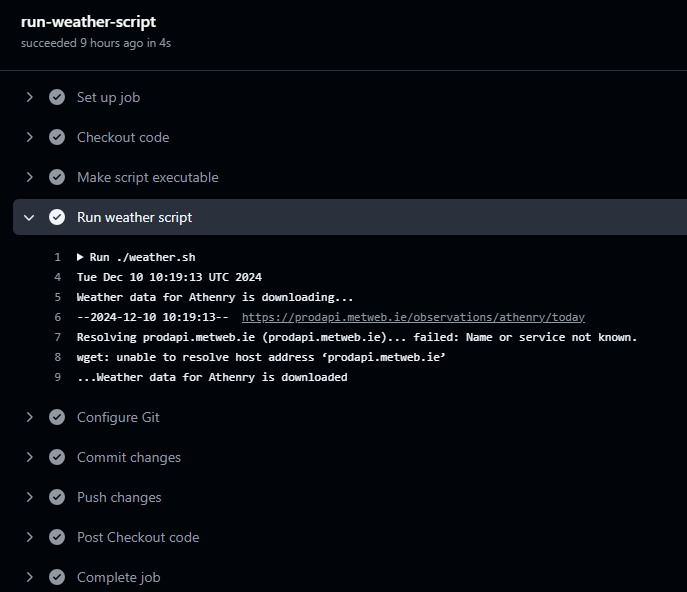
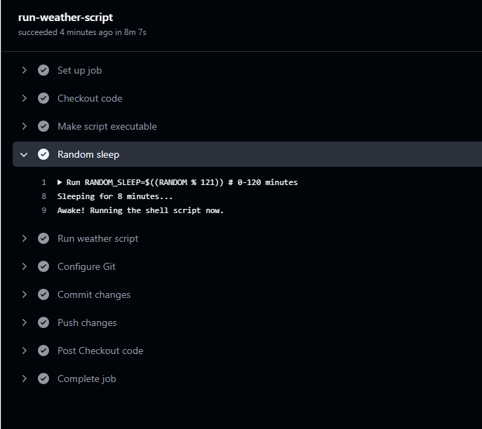

# Computer infrastructure Assessment

This Github repo contains the assessment completed as part of the Computer Infrastructure module done as part of the Higher Diploma in Computing (Data Analysis) at ATU Galway. The assessment is made up of two components, namely the project and tasks.

## **Tasks**

There is a series of nine tasks completed (shown below) to work through various aspects of computer architecture. 
- *Task 1: Create Directory  Structure* - Using the command line, create a directory named `data` at the root of your repository. Inside `data`, create two subdirectories: `timestamps` and `weather`.
- *Task 2: Timestamps* - Navigate to the `data/timestamps directory`. Use the `date` command to output the current date and time, appending the output to a file named `now.txt`. Make sure to use the `>>` operator to append (not overwrite) the file. Repeat this step ten times, then use the `more` command to verify that `now.txt` has the expected content.
- *Task 3: Formatting Timestamps* -  Run the `date` command again, but this time format the output using `YYYYmmdd_HHMMSS` (e.g., `20261114_130003` for 1:00:03 PM on November 14, 2026). Refer to the `date` man page (using `man date`) for more formatting options. (Press q to exit the man page). Append the formatted output to a file named `formatted.txt`.
- *Task 4: Create timestamped files* - Use the `touch` command to create an empty file with a name in the `YYYYmmdd_HHMMSS.txt` format. 
- *Task 5: Download today's weather data* - Change to the `data/weather` directory. Download the latest weather data for the [Athenry weather station](https://prodapi.metweb.ie/observations/athenry/today) from Met Éireann using `wget`. Use the `-O <filename>` option to save the file as `weather.json`. 
- *Task 6: Timestamp the data* - Modify the command from Task 5 to save the downloaded file with a timestamped name in the format `YYYYmmdd_HHMMSS.json`.
- *Task 7: Write the script* - Write a bash script called `weather.sh` in the root of your repository. This script should automate the process from Task 6, saving the weather data to the `data/weather` directory. Make the script executable and test it by running it.
- *Task 8: Notebook* - Create a notebook called [`weather.ipynb`](https://github.com/EllenMcG/computer_infrastructure_assessment/blob/main/weather.ipynb) at the root of your repository. In this notebook, write a brief report explaining how you completed Tasks 1 to 7. Provide short descriptions of the commands used in each task and explain their role in completing the tasks.
- *Task 9: pandas* - In the [`weather.ipynb`](https://github.com/EllenMcG/computer_infrastructure_assessment/blob/main/weather.ipynb) notebook, use the `pandas` function `read_json()` to load in any one of the weather data files you have downloaded with your script. Examine and summarize the data. Use the information provided by data.gov.ie to write a short explanation of what the data set contains.

**Note:** while Athenry is used as the weather station, there are a total of 20 automatic monitoring stations in Ireland used by Mét Eireann showing below. 


## **Project**

As part of the project, the shell script *weather.sh* will be automated to push data to the `data/weather` directory in a Github Action in the below steps. 
- *1: Create a GitHub Actions Workflow* - In the root of the repository, create a folder called `.github/workflows/`. Inside this folder, create a file called `weather-data.yml` which will define the GitHub Actions workflow.
- *2: Run Daily at 10am* - Use the `schedule` event with `cron` to set the script to run once a day at 10am. Include also the `workflow_dispatch` event so you can test the workflow.
- *3: Linux Virtual Machine* - Use a Linux Virtual Machine In the workflow file, specify that a Ubuntu virtual machine should be used to run the action.
- *4: Clone:* - Clone the Repository Have the workflow clone your repository.
- *5 Execute `weather.sh` shell script* - Add a step that runs the `weather.sh` script.
- *6 Commit and Push Changes Back to the Repository* - Finally, configure the workflow to commit the new weather data and push those changes back to the `computer_infrastructure_assessment` repository.
- *7 Test the Workflow* - Commit and push the workflow to the `computer_infrastructure_assessment`  repository. Check the logs in GitHub to ensure that the `weather.sh` script runs correctly, that new data is being committed.

**Note:** The script has being running for nearly two weeks, but has broken due to so many requests on Mét Eireanns API which returns the below error 



The `run_weather.yml` file has being changed to change the `cron` command from 

```
- cron: '0 10 * * *'  # Runs at 10 AM UTC every day
```

to 
```
- cron: '45 11 * * *'  # Runs at 11:45 AM UTC every day
```

Manually running the workflow showed it worked. The weather file with no data within the `.json` file was deleted from `data/weather` (`20241210_101913.json`). While this would work for a few days it may be blocked by the Mét Eireann API so to counteract this a random sleep was used before running `weather.sh`. The [RANDOM](https://www.geeksforgeeks.org/random-shell-variable-in-linux-with-examples/) shell variabe returns a number between 0–32767, however it was not seeded with an initial value. The value is between 0 and 120 (0-121) and the value is multiplied to return minutes so that the program will sleep for X minutes before running the `weather.sh` shell script with the below code added to the `run_weather.yml` file.


```
      - name: Random sleep
        run: |
          RANDOM_SLEEP=$((RANDOM % 121)) # 0-120 minutes
          echo "Sleeping for $RANDOM_SLEEP minutes..."
          SLEEP_TIME=$((RANDOM_SLEEP * 60)) # convert to minutes
          sleep $SLEEP_TIME
          echo "Awake! Running the shell script now."
```

When the action was run manually the random code looks like the below in the log file.



## **Development and Environment**
Both the tasks and projected were completed in [`Visual Studio Code`](https://code.visualstudio.com/) using python (V3.11) though [`Anaconda`](https://www.anaconda.com/). [ChatGPT](https://chatgpt.com/) was used to assist with writing the workflow file for the project. No additional python modules needed as this was done using modules available within Anaconda. 

## **Repository structure** 
This repository has the below structure 

```
/computer_infrastructure_assessment
├── /.github/           
│   ├── /workflows/         # contains run_weather.yml workflow file
├── /data/                  # data files generated in weather.ipynb
│   ├── /timestamps/        # timestamp files generated in weather.ipynb
│   └── /weather/           # weather files generated in weather.ipynb
├── /img                    # directory of image files
├── .gitignore              # .gitignore file
├── README.md               # README.md file 
├── requirements.txt        # python dependencies
├── weather.ipynb           # main Jupyter Notebook of this module  
└── weathersh               # Executable shell file 
```


## **Running this repository**
This repo can be run in two ways;
- Running locally
- Github codespaces

### **Running this repository locally** 

To be run locally, the user must have [`Anaconda`](https://www.anaconda.com/) (or similar) and an IDE ([`Visual Studio Code`](https://code.visualstudio.com/) was used for this project). 

1. Clone the repository
```
$ git clone https://github.com/EllenMcG/computer_infrastructure_assessment.git
```

2. Open `weather.ipynb` in `Visual Studio Code` and run

3. To run `weather.sh` the user must make the file executable as shown below

```
chmod u+x ./weather.sh
./weather.sh 
```

#### **Dependencies** 
Note: if user is not using an IDE but just using python then the dependencies need to be installed first listed in the `requirements.txt` file below.

``` 
$ pip install -r requirements.txt
```

An alternative way to install dependencies not using the `requirements.txt` file is shown below; 

```
$ pip install os pandas datetime
```

### **Running this repositry on Github Codespaces**

GitHub Codespaces is an online IDE that allows you to run your project in a cloud-based environment without needing to set up anything on your local machine. Here's how to get started:

1. Open the repository in GitHub Codespaces:
- Go to the repository's page on GitHub.
- Click the green Code button.
- Select Open with Codespaces.

2. Start the Jupyter Notebook in Codespaces:
Once your Codespace is ready:
- Open the integrated terminal in GitHub Codespaces.
- Make sure your virtual environment is activated (if you're using one). If not, you can skip this step.
- Open `weather.ipynb` in `Visual Studio Code` and run 
